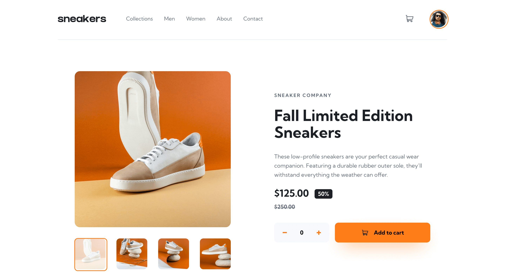
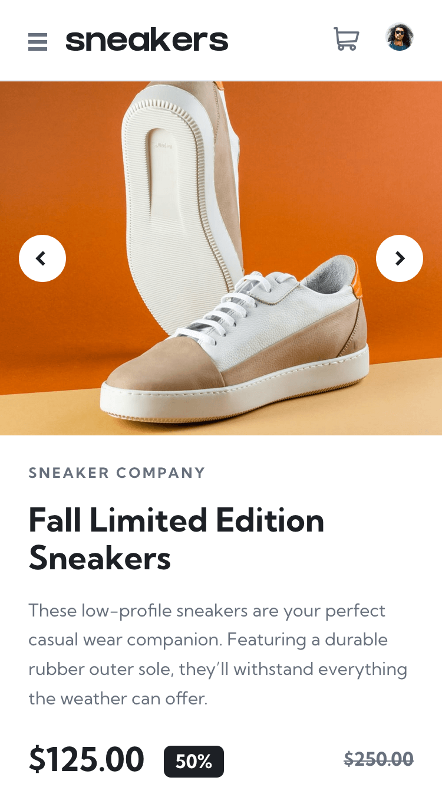

# Frontend Mentor - E-commerce product page solution

This is a solution to the [E-commerce product page challenge on Frontend Mentor](https://www.frontendmentor.io/challenges/ecommerce-product-page-UPsZ9MJp6). Frontend Mentor challenges help you improve your coding skills by building realistic projects.

## Table of contents

- [Overview](#overview)
  - [The challenge](#the-challenge)
  - [Screenshot](#screenshot)
  - [Links](#links)
- [My process](#my-process)
  - [Built with](#built-with)
  - [What I learned](#what-i-learned)
  - [Continued development](#continued-development)
  - [Useful resources](#useful-resources)
- [Author](#author)

## Overview

### The challenge

Users should be able to:

- View the optimal layout for the site depending on their device's screen size
- See hover states for all interactive elements on the page
- Open a lightbox gallery by clicking on the large product image
- Switch the large product image by clicking on the small thumbnail images
- Add items to the cart
- View the cart and remove items from it

### Screenshot




### Links

- Solution URL: [https://github.com/srijanss/ecommerce-product-page](https://github.com/srijanss/ecommerce-product-page)
- Live Site URL: [https://srijanss.github.io/ecommerce-product-page/](https://srijanss.github.io/ecommerce-product-page/)

## My process

### Built with

- Semantic HTML5 markup
- CSS custom properties
- Flexbox
- CSS Grid
- Mobile-first workflow
- [Vite](https://vitejs.dev/) - Lightweight frontend tooling
- [PostCSS](https://postcss.org/) - Tool to transform CSS using plugins

### What I learned

- I learned about different aria attributes which will make screen readers aware about the state changes within the app
- aria-live, role="alert", role="status" were helpful to let screen readers know what is happening when they click button or there is an error submitting a form

```html
<p id="error-message" role="alert" aria-live="true" aria-atomic="true"></p>
<p
  id="success-message"
  class="visually-hidden"
  role="status"
  aria-live="polite"
  aria-atomic="true"
></p>
```

- another important thing I learned regarding the popup within the app is to trap focus within the opened dialog box, so that keyboard users and screen readers have an idea on where the current active element is

```js
setFocusTrap() {
    Array.from(this.focusableElements).forEach((element) => {
      element.addEventListener("keydown", (e) => {
        if (e.key === "Tab") {
          if (e.shiftKey) {
            if (e.currentTarget === this.focusableElements[0]) {
              e.preventDefault();
              this.focusableElements[this.focusableElements.length - 1].focus();
            }
          } else {
            if (
              e.currentTarget ===
              this.focusableElements[this.focusableElements.length - 1]
            ) {
              e.preventDefault();
              this.focusableElements[0].focus();
            }
          }
        }
      });
    });
}
```

- using the calc method was really helpful to figure out how to place the on hover border on nav links

```css
& a:hover {
  --border-size: 4px;
  position: relative;
  color: var(--color-very-dark-blue);
  &:after {
    content: "";
    position: absolute;
    width: 100%;
    left: 0;
    top: calc(
      (50% + (var(--nav-height-desktop) / 2)) + var(
          --nav-padding-bottom-desktop
        ) - var(--border-size)
    );
    border-bottom: var(--border-size) solid var(--color-orange);
  }
}
```

- I learned a lot about how to build image slider
- I learned how to duplicate first and last item in the image list to create infinite slider
- And building the lightbox using the clone of image gallery was really fun

```js
handlePreviousBtnClick(slider) {
    this.productImageCurrentIndex -= 1;
    this.slideProductImage(slider, this.productImageCurrentIndex);
    if (this.productImageCurrentIndex === 0) {
      setTimeout(() => {
        this.productImageCurrentIndex = slider.children.length - 2;
        this.slideProductImage(slider, this.productImageCurrentIndex, true);
      }, this.transitionDuration);
    }
  }

  handleNextBtnClick(slider) {
    this.productImageCurrentIndex += 1;
    this.slideProductImage(slider, this.productImageCurrentIndex);
    if (this.productImageCurrentIndex === slider.children.length - 1) {
      setTimeout(() => {
        this.productImageCurrentIndex = 1;
        this.slideProductImage(slider, this.productImageCurrentIndex, true);
      }, this.transitionDuration);
    }
  }
```

### Continued development

- I would like to use Svelte framework to build this solution in the future.

### Useful resources

- [Accessibility ARIA](https://developer.mozilla.org/en-US/docs/Web/Accessibility/ARIA)

## Author

- Website - [Srijan Manandhar](https://github.com/srijanss)
- Frontend Mentor - [@srijanss](https://www.frontendmentor.io/profile/srijanss)
